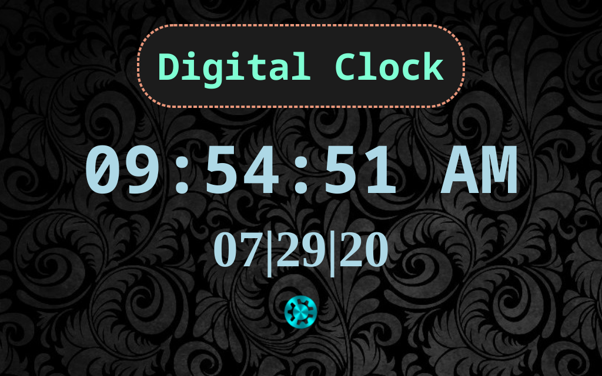

# Digital Clock App

> Digital clock app written in JS, HTML & CSS

  

Check it out [here](https://bbastanza.github.io/digitalclock/)

## Summary

I made this app as the beginning to my Javascript journey. I had worked with python previously and was excited to challenge myself to a new language.

Building this app I learned about sytax, how to use DOM manipulation and how to use setInterval() funcitons.

It was challenging at the time, but I learned a ton in the process.

#

## Author

### Brian Bastanza- Full Stack Web Developer

[Personal Website](www.brianbastanza.com)

[LinkedIn](www.linkedin.com/in/brian-bastanza-9035397b)
